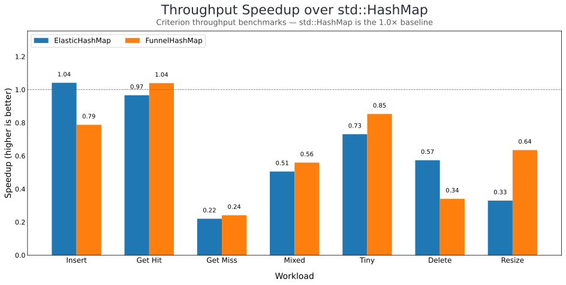
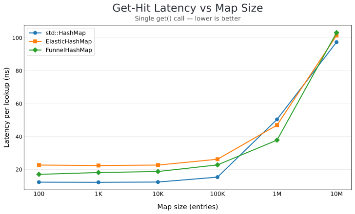

# opthash

Rust implementations of **Elastic Hashing** and **Funnel Hashing** from [*Optimal Bounds for Open Addressing Without Reordering*](https://arxiv.org/abs/2501.02305) (Farach-Colton, Krapivin, Kuszmaul, 2025).

Both are open-addressing hash maps that achieve optimal expected probe complexity without reordering elements after insertion.

## Data Structures

* **`ElasticHashMap<K, V>`** — Multi-level table with geometrically halving levels. Each level is a `RawTable` plus probe budgets, group steps, and tombstone accounting.
* **`FunnelHashMap<K, V>`** — Multi-level bucketed table with per-bucket metadata and a split special array: `primary` (group-probed) plus `fallback` (two-choice buckets).

Both support `insert`, `get`, `get_mut`, `contains_key`, `remove`, and `clear`. Maps start with zero allocation (`new()`) and grow dynamically on demand. Advanced tuning is available through `ElasticOptions`, `FunnelOptions`, and `with_options(...)`.

## Usage

```rust
use opthash::{ElasticHashMap, ElasticOptions, FunnelHashMap, FunnelOptions};

let mut map = ElasticHashMap::new();
map.insert("key", 42);
assert_eq!(map.get("key"), Some(&42));

let mut map = ElasticHashMap::with_options(ElasticOptions {
    capacity: 1024,
    reserve_fraction: 0.10,
    probe_scale: 12.0,
});
map.insert("key", 42);
assert_eq!(map.get("key"), Some(&42));

let mut map = FunnelHashMap::with_options(FunnelOptions {
    capacity: 1024,
    reserve_fraction: 0.10,
    primary_probe_limit: Some(8),
});
map.insert("key", 42);
assert_eq!(map.get("key"), Some(&42));
```

### Layout Sketch

```text
RawTable (shared by both maps)
==============================

  fp = fingerprint (7-bit control byte)
  kv = key-value entry, __ = empty, xx = tombstone

  Single allocation, slots first, controls at the end:

  data_ptr ► [kv][kv][  ][kv][  ][kv]... [pad] [fp][fp][__][xx][__][fp]...
             └──── slots (T-aligned) ────┘     └─ controls (16-aligned) ──┘
                                               ▲ ctrl_offset

  No per-group metadata. Occupancy is derived from SIMD scans of the control bytes
  (eq_mask_16 for fingerprints, free_mask_16 for free slots).


ElasticHashMap
==============

  levels: Vec<Level>

    Level 0    RawTable  (largest, ~half of total capacity)
    Level 1    RawTable  (geometrically halved)
    Level 2    ...

    per-level  len, tombstones, half_reserve_slot_threshold,
               limited_probe_budgets, group_steps, salt

  table-wide   len, capacity, max_insertions, reserve_fraction,
               probe_scale, batch_plan, current_batch_index,
               batch_remaining, max_populated_level, hash_builder


FunnelHashMap
=============

  levels: Vec<BucketLevel>

    Level 0
      slots:     kv kv __ __ ... kv kv __ __ ... kv ...
      controls:  fp fp __ __ ... fp fp __ __ ... fp ...
                 └── bucket 0 ──┘└── bucket 1 ──┘

    Level 1    (same layout, smaller buckets)
    ...

    per-level  len, tombstones, bucket_size, bucket_count

  special: SpecialArray

    primary    RawTable, group-probed (like elastic)
    (paper B)  len, group_summaries, group_tombstones, group_steps

    fallback   RawTable, two-choice bucketed
    (paper C)  len, tombstones, bucket_size, bucket_count

  table-wide   len, capacity, max_insertions, reserve_fraction,
               primary_probe_limit, max_populated_level, hash_builder
```

## Benchmarks

All benchmarks on Apple M1 (aarch64, NEON SIMD) via Criterion. `std::HashMap` uses the same `RandomState` (SipHash) hasher as both custom maps.

### Throughput



### Latency



### Running benchmarks

```bash
cargo bench --bench benchmarks            # run all throughput + latency benchmarks
uv run scripts/generate_speedup_chart.py  # regenerate charts from Criterion JSON
```

Criterion also generates an interactive HTML report at `target/criterion/report/index.html`.
