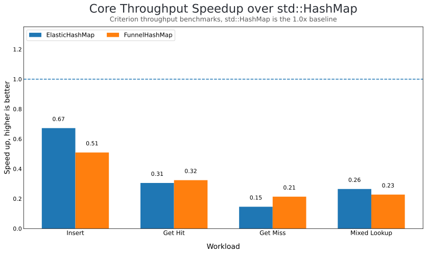
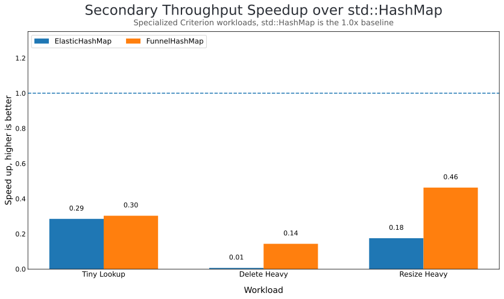

# opthash

Rust implementations of **Elastic Hashing** and **Funnel Hashing** from [_Optimal Bounds for Open Addressing Without Reordering_](https://arxiv.org/abs/2501.02305) (Farach-Colton, Krapivin, Kuszmaul, 2025).

Both are open-addressing hash maps that achieve optimal expected probe complexity without reordering elements after insertion.

## Data Structures

- **`ElasticHashMap<K, V>`** — Multi-level table with geometrically halving levels. Each level is a `RawTable` plus probe budgets, group steps, and tombstone accounting.
- **`FunnelHashMap<K, V>`** — Multi-level bucketed table with per-bucket metadata and a split special array: `primary` (group-probed) plus `fallback` (two-choice buckets).

Both support `insert`, `get`, `get_mut`, `contains_key`, `remove`, and `clear`. Maps start with zero allocation (`new()`) and grow dynamically on demand. Advanced tuning is available through `ElasticOptions`, `FunnelOptions`, and `with_options(...)`.

## Usage

```rust
use opthash::{ElasticHashMap, ElasticOptions, FunnelHashMap, FunnelOptions};

let mut map = FunnelHashMap::new();
map.insert("key", 42);
assert_eq!(map.get("key"), Some(&42));

let tuned_funnel = FunnelHashMap::<u64, u64>::with_options(FunnelOptions {
    capacity: 1024,
    reserve_fraction: 0.10,
    primary_probe_limit: Some(8),
});
assert_eq!(tuned_funnel.len(), 0);

let tuned = ElasticHashMap::<u64, u64>::with_options(ElasticOptions {
    capacity: 1024,
    reserve_fraction: 0.10,
    probe_scale: 12.0,
});
assert_eq!(tuned.len(), 0);
```

### Layout Sketch

```text
ElasticHashMap
==============

levels: Vec<Level>

Level 0
  controls [fp][  ][fp][xx][  ][fp][  ][  ] ...
  slots    [kv][  ][kv][kv][  ][kv][  ][  ] ...
  meta     len
           tombstones
           half_reserve_slot_threshold
           limited_probe_budgets
           group_steps
           salt

Level 1
  controls [  ][fp][  ][  ][fp] ...
  slots    [  ][kv][  ][  ][kv] ...
  meta     len
           tombstones
           half_reserve_slot_threshold
           limited_probe_budgets
           group_steps
           salt

Level 2
  controls [fp][  ][  ] ...
  slots    [kv][  ][  ] ...
  meta     len
           tombstones
           half_reserve_slot_threshold
           limited_probe_budgets
           group_steps
           salt

table-wide
  len
  capacity
  max_insertions
  reserve_fraction
  probe_scale
  batch_plan
  current_batch_index
  batch_remaining
  max_populated_level
  hash_builder


FunnelHashMap
=============

levels: Vec<BucketLevel>

Level 0
  bucket 0  controls [fp][fp][  ][  ]
            slots    [kv][kv][  ][  ]
            meta     BucketMeta {
                       summary,
                       live_mask,
                       search_len,
                       live,
                       tombstones,
                     }
  bucket 1  controls [fp][  ][  ][  ]
            slots    [kv][  ][  ][  ]
            meta     BucketMeta { ... }

Level 1
  bucket 0  controls [fp][  ][  ][  ]
            slots    [kv][  ][  ][  ]
            meta     BucketMeta { ... }
  ...

special: SpecialArray
  primary  (paper B)
    controls [fp][  ][fp][  ] ...
    slots    [kv][  ][kv][  ] ...
    meta     len
             group_summaries
             group_tombstones
             group_steps

  fallback (paper C)
    bucket 0 controls [fp][  ]
             slots    [kv][  ]
    bucket 1 controls [  ][fp]
             slots    [  ][kv]
    meta      len
              bucket_size
              bucket_count
              bucket_summaries
              bucket_live
              bucket_tombstones

table-wide
  len
  capacity
  max_insertions
  reserve_fraction
  primary_probe_limit
  max_populated_level
  hash_builder
```

## Benchmarks

Current Criterion throughput results on Apple M1 (aarch64, NEON SIMD), normalized so `std::HashMap` is the `1.0x` baseline:

Core workloads:



Secondary workloads:



Regenerate the benchmark chart:

```bash
cargo bench --bench throughput
uv venv
uv pip install -r requirements.txt
uv run scripts/generate_speedup_chart.py
```

Criterion also generates an interactive HTML report at `target/criterion/report/index.html`.
