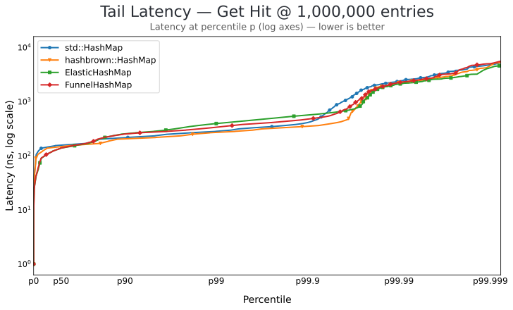
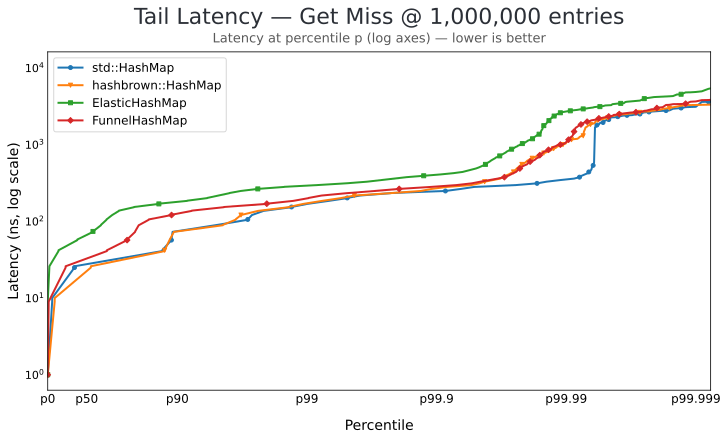
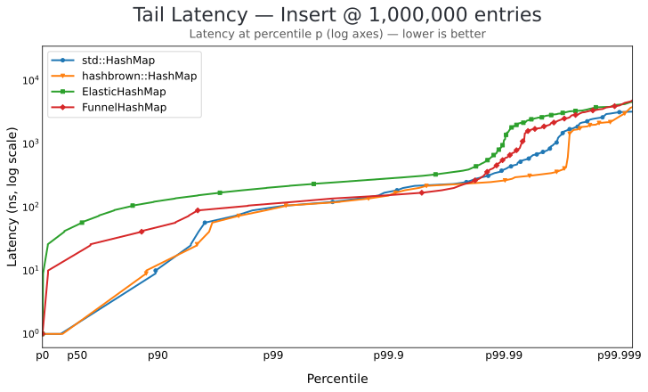
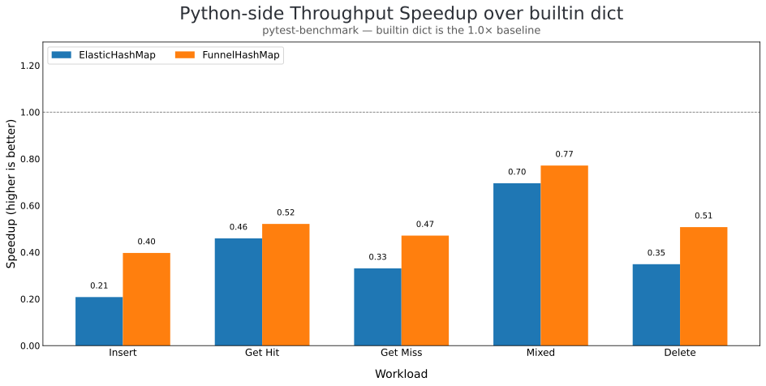

# Benchmarking

Two Rust bench targets compare `std::collections::HashMap`, `hashbrown::HashMap`, `opthash::ElasticHashMap`, `opthash::FunnelHashMap`. Shared fixtures live in `benches/common.rs`. A Python-side bench (`benches/python.py`) compares the opthash bindings against builtin `dict`.

All Rust benchmarks were run on ARM Cortex-X925 (Armv9.2-A, aarch64, NEON, 3.9 GHz) Linux via Criterion.

## Results

### Throughput (Rust, vs `std::HashMap`)


### Mean latency by map size (Rust)


### Tail latency distributions @ 1M entries (Rust)







### Python: opthash bindings vs builtin `dict`



The Python chart is a reality check, not a perf claim. The opthash bindings cross GIL → `HashedAny::hash()` → Python bytecode per op, so `dict` will usually win — the point is to know by how much and where.

## `benches/speedup.rs` — throughput + mean latency (Criterion)

Throughput workloads:

1. `insert_throughput`
2. `get_hit_throughput`
3. `get_miss_throughput`
4. `tiny_lookup_throughput`
5. `delete_heavy_throughput`
6. `resize_heavy_throughput`
7. `mixed_lookup_throughput`

The tiny-map workload exercises the internal tiny-table engine. Delete-heavy and resize-heavy expose tombstone handling and growth costs instead of only steady-state inserts.

Latency workload: `get_hit_latency_<size>` for sizes 100, 1K, 10K, 100K, 1M — Criterion-mean per-lookup time.

Run:

```bash
cargo bench --bench speedup
cargo bench --bench speedup -- "get_hit"          # Criterion name filter
```

## `benches/latency.rs` — tail-latency histograms (hdrhistogram)

Captures per-operation latency distributions (p50/p90/p99/p999/p9999/max) and dumps them to JSON for plotting. Custom `harness = false` main, not Criterion. Hard-coded matrix: sizes 10K/100K/1M × ops get-hit/get-miss/insert × {std, elastic, funnel} × 1M samples × 10K warmup — edit the consts at the top of `benches/latency.rs` to change. Output: `target/latency/<map>/<size>/<op>.json`.

```bash
cargo bench --bench latency
```

## Reports

- Criterion HTML: `target/criterion/report/index.html`, per-workload pages below (e.g. `target/criterion/insert_throughput/report/index.html`)
- Charts: `uv run scripts/generate_all_charts.py` writes every SVG to `assets/` (speedup bars, mean-latency line, tail CDFs per config)

## Profiling / flamegraphs

`benches/speedup.rs` integrates a `pprof` profiler. Pass `--profile-time N` and Criterion captures CPU samples instead of timing, writing `target/criterion/<workload>/<impl>/profile/flamegraph.svg`.

```bash
cargo bench --bench speedup -- --profile-time 5
cargo bench --bench speedup -- --profile-time 5 "get_hit"
```
